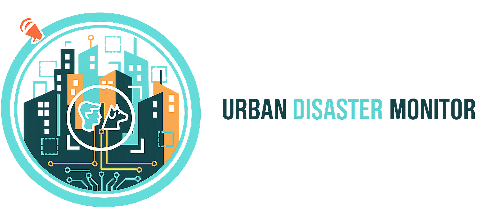
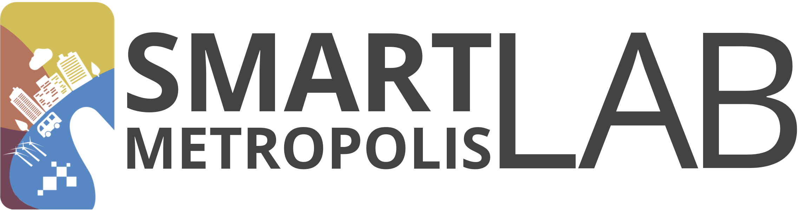
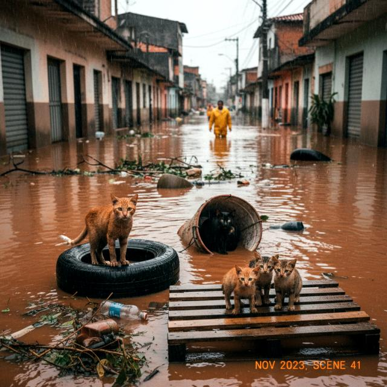

<div align="center">

<br>

[](https://docs.ultralytics.com/models/yolov8/#yolov8-usage-examples)  

[Dataset](./dataset) | [Models](./models) | [Notebooks](./notebooks) | [Kaggle](https://www.kaggle.com/datasets/mariacsoares/urban-disaster-object-detection-dataset/data) | [Roboflow](https://universe.roboflow.com/ufrnprojects-xlut9/urban-disaster-monitor) | [App](https://huggingface.co/spaces/carolinasoares/urban-disaster-monitor-v2)

Português | [English](./README.md)

</div>

# Urban Disaster Monitor

### Detecção e classificação de civis, animais e socorristas em cenários de desastre urbano, utilizando YOLOv11

Em situações de desastre urbano, cada segundo importa. Este projeto oferece uma ferramenta de visão computacional para ajudar equipes de resgate a agir com mais precisão e velocidade.

<div align="center">

 

</div><br>

## Estrutura de Pastas

```
.
├── app
│   ├── examples
│   ├── app.py
│   ├── README.md
│   └── requirements.txt
├── notebooks
│   ├── coco-vs-yolo-comparison.ipynb
│   ├── generative-images-synthetic-gemini.ipynb
│   ├── metrics-and-comparison-yolo-models.ipynb
│   ├── simulation-video-yolo.ipynb
│   └── training-yolo-dataset.ipynb
├── dataset
│   ├── test
│   │   ├── images
│   │   └── labels
│   ├── train
│   │   ├── images
│   │   └── labels
│   ├── valid
│   │   ├── images
│   │   └── labels
│   ├── data.yaml
│   ├── README.dataset.txt
│   └── README.roboflow.txt
├── models
│   ├── yolov11l
│   ├── yolov11m
│   ├── yolov11n
│   └── yolov11s
└── static
    ├── gif
    ├── images
    └── video
```

## Sumário

- [Sobre o projeto](#sobre-o-projeto)
  - [Funcionalidades](#funcionalidades)
  - [Contexto institucional](#contexto-institucional)
- [Dataset](#dataset)
  - [Pré-processamento e augmentations](#pré-processamento-e-augmentations)
  - [Composição por classe](#composição-por-classe)
  - [Por que dataset customizado?](#por-que-dataset-customizado)
  - [Aquisição de dados](#aquisição-de-dados)
    - [Imagens públicas](#imagens-públicas)
    - [Imagens sintéticas (Gemini 2.5 Flash Image)](#imagens-sintéticas-gemini-25-flash-image)
- [Anotações e Modelo](#anotações-e-modelo)
  - [Classes (Roboflow)](#classes-roboflow)
  - [Arquitetura](#arquitetura)
  - [Fluxo de treinamento](#fluxo-de-treinamento)
  - [Ambiente de treinamento (Colab + GPU T4)](#ambiente-de-treinamento-colab--gpu-t4)
- [Métricas e resultados](#métricas-e-resultados)
  - [Resultados por variante](#resultados-por-variante-map05)
  - [Resultados por classe](#resultados-por-classe)
  - [Treino customizado vs. COCO pré-treinado](#treino-customizado-vs-coco-pré-treinado)
  - [Simulação em vídeo](#simulação-em-vídeo)
- [Conclusões e recomendações por modelo](#conclusões-e-recomendações-por-modelo)
  - [Trabalhos futuros](#trabalhos-futuros)
- [Interface Interativa](#interface-interativa)
  - [Testar online](#testar-online)
  - [Funcionalidades](#funcionalidades)
  - [Tecnologias](#tecnologias)
  - [Executar localmente](#executar-localmente)
- [Equipe](#equipe)
- [Licença](#licença)
- [Referências Bibliográficas](#referências-bibliográficas)

## Sobre o projeto

O **Urban Disaster Monitor** é um sistema de visão computacional para detecção e classificação de **indivíduos** (Civis e Socorristas) e **animais** (Vacas, Cavalos, Cachorros e Gatos) em cenários de desastres urbanos. Em situações de colapso estrutural, inundações ou deslizamentos, identificar rapidamente civis e socorristas em tempo real é crucial para otimizar recursos e reduzir fatalidades. O sistema utiliza **YOLOv11** para fornecer suporte às equipes de emergência durante a resposta a desastres.

### Funcionalidades

- Detecção e classificação de **Civis**, **Socorristas**, **Vacas**, **Cavalos**, **Cachorros** e **Gatos**
- Visualização de **métricas** e **bounding boxes**
- Interface interativa via **Gradio** para upload e teste de imagens e vídeos

### Contexto institucional

O projeto teve início durante a disciplina de Visão Computacional ministrada pelo **Prof. Dr. [Helton Maia](https://heltonmaia.com/)** na **ECT/UFRN**. Foi desenvolvido voluntariamente para o **Smart Metropolis** (IMD/UFRN) no âmbito do **Projeto SPICI (Segurança Pública Integrada em Cidades Inteligentes)**, consistindo uma plataforma inteligente de coleta, processamento e análise de imagens em tempo real para gestão de crises e desastres.

<a href="https://smlab.imd.ufrn.br/"></a> <a href="https://smlab.imd.ufrn.br/projeto-spici/"></a> <a href="https://imd.ufrn.br/"></a> <a href="https://www.ect.ufrn.br/"></a>

## Dataset

O dataset foi desenvolvido para **detecção e contagem de sobreviventes** (civis, socorristas e animais) em cenários de emergência, incluindo inundações, deslizamentos, colapsos estruturais e regiões rurais alagadas. O conjunto inicial contava com 1.903 imagens; após pré-processamento e augmentations, o dataset final totaliza **3.240 imagens**, distribuídas em **6 classes** selecionadas com base em demandas operacionais reais, em particular no contexto brasileiro. O dataset segue distribuição **multi-label** (uma mesma imagem pode conter múltiplas classes simultaneamente).

### Pré-processamento e augmentations

- **Auto-orientação:** alinhamento consistente das imagens
- **Redimensionamento:** 640×640 px (stretch)
- **Contraste:** stretching para melhorar detalhes em cenas de baixa visibilidade
- **Augmentations:** 2 variantes geradas por amostra original
  - Rotação: ±15°
  - Shear: ±10° horizontal e vertical
  - Tons de cinza: 15% das imagens
  - Saturação: ±25%
  - Ruído esparso: até 0,89% dos pixels

### Composição por classe

| Classe | Objetos anotados | Imagens contendo a classe |
|--------|------------------|---------------------------|
| civilian | 3.150 | 1.060 |
| rescuer | 1.074 | 397 |
| dog | 531 | 373 |
| cat | 637 | 207 |
| horse | 811 | 279 |
| cow | 749 | 180 |

*Objetos anotados* indica o total de bounding boxes por classe; *imagens contendo a classe* indica em quantas imagens distintas cada classe aparece. A classe **rescuer** foi introduzida para evitar alertas em áreas ocupadas apenas por equipes de emergência, reduzindo falsos positivos. O critério de distinção entre socorristas e civis baseia-se em atributos visuais como capacetes, coletes refletivos ou uniformes vermelho-amarelos típicos de equipes de resgate.

- **Anotação:** [Roboflow](https://universe.roboflow.com/ufrnprojects-xlut9/urban-disaster-monitor/)
- **Particionamento:** 83% treino (2.674) / 12% validação (383) / 6% teste (183) 
- **Dataset particionado:** [dataset](./dataset)
- **Licença:** [CC BY 4.0](https://creativecommons.org/licenses/by/4.0/deed.en)

### Por que dataset customizado?

Datasets em larga escala como **COCO** não atendem bem a cenários de desastre. O COCO não diferencia *rescuer* de *civilian* e representa todos como "person", o que compromete sistemas de alerta, áreas exclusivamente ocupadas por equipes de resgate gerariam falsos positivos. Além disso, modelos pré-treinados em COCO têm dificuldade em cenários pouco representados, como pessoas ou animais parcialmente submersos em água. Um dataset específico de domínio era necessário.

### Aquisição de dados

O dataset combina **imagens em cenários reais de repositórios públicos** e **imagens sintéticas geradas por IA**, mitigando a escassez de dados reais de alta qualidade em ambientes de desastre.

#### Imagens públicas

Coletadas de fontes com licença aberta ou compartilhável:

- [Wikimedia Commons](https://commons.wikimedia.org/)
- [Flickr](https://www.flickr.com/)
- [Google Images](https://images.google.com)
- [Roboflow Universe](https://universe.roboflow.com/)

<div align="center">

 
 

</div>

#### Imagens sintéticas (Gemini 2.5 Flash Image)

Foram geradas **832 imagens sintéticas** com o modelo [Gemini 2.5 Flash Image](https://developers.googleblog.com/introducing-gemini-2-5-flash-image/) para reduzir desbalanceamento de classes e aumentar variabilidade contextual, especialmente em classes de animais. Os prompts seguem estilo documental/fotojornalístico, com:

- **Cenários autênticos de desastre:** ruas alagadas, campos inundados, casas submersas, animais em situações de resgate ou isolamento.
- **Diversidade de espécies:** cavalos, vacas, cachorros e gatos em diferentes contextos de inundação.
- **Variação de qualidade e resolução:** desde imagens de baixa resolução até fotos mais nítidas, simulando registros reais de campo.
- **Detalhes visuais:** proporções realistas, expressões visíveis, corpos inteiros ou parcialmente submersos, detritos, céu nublado, iluminação natural.
- **Situações variadas:** animais sozinhos, em grupos, sendo resgatados, presos em telhados, varandas, cercas ou objetos flutuantes.
- **Ambientes urbanos e rurais:** ruas, casas, pastos e fazendas afetados por enchentes.

Cada imagem foi revisada manualmente. As amostras sintéticas complementam as reais e ampliam a variabilidade intraclasse de *dog*, *cat*, *cow* e *horse*.

<div align="center">




</div><br>

Exemplos de prompts:

1. "Authentic documentary photo of a brown horse standing in a flooded street after heavy rain, realistic proportions, clear body visible, imperfect disaster photo"

2. "Documentary style photo of a white horse trapped in a pasture with floodwater, overcast sky, realistic proportions, authentic disaster scene"

3. "Low-resolution documentary photo of two wet cats stranded on a rooftop surrounded by floodwater, realistic proportions, visible faces, authentic urban flood event"

4. "Low quality documentary style photo of a stray dog on a small wooden raft during flood, rescue scene, realistic body intact"

5. "Documentary flood photo of cows standing in a partially submerged field, water up to their legs, cloudy sky, authentic proportions"

6. "Realistic low-resolution documentary photo of a cow isolated in floodwater reflecting sunset colors, authentic disaster photo"

[Notebook de geração de imagens sintéticas](./notebooks/generative-images-synthetic-gemini.ipynb)

## Anotações e Modelo

As anotações foram realizadas na plataforma **Roboflow** e convertidas para o formato YOLO. O modelo YOLOv11 é treinado nas seis classes definidas abaixo, com validação contínua e avaliação em conjunto de teste independente.

### Classes (Roboflow)

| Classe | Descrição |
|--------|-----------|
| `civilian` | Indivíduos não identificados como equipes de resgate |
| `rescuer` | Equipes de emergência com uniformes, EPI (capacetes, coletes) |
| `cat`, `dog` | Animais domésticos em cenários urbanos |
| `cow`, `horse` | Animais de grande porte em áreas rurais/urbanas periféricas |

### Arquitetura

O modelo utiliza **YOLO** (You Only Look Once), referência em detecção de objetos em tempo real: formula a tarefa como um único problema de regressão que prediz bounding boxes e probabilidades de classe diretamente da imagem, permitindo otimização end-to-end e alta velocidade de inferência.

**YOLOv11** (Ultralytics) é a versão mais recente, com compatibilidade para conversão entre frameworks. Variantes treinadas: YOLOv11n (nano), YOLOv11s (small), YOLOv11m (medium) e YOLOv11l (large).

### Fluxo de treinamento

1. **Conversão:** anotações Roboflow para formato YOLO (`.txt`)
2. **Treino iterativo:** parâmetros acima; otimizadores Adam ou SGD
3. **Validação contínua:** métricas em tempo real, detecção de *overfitting*, early stopping
4. **Avaliação final:** conjunto de teste independente para verificar generalização

### Ambiente de treinamento (Colab + GPU T4)

O treinamento foi realizado no **Google Colab** utilizando GPUs **NVIDIA T4**. Exemplo de chamada com Ultralytics:

```python
from ultralytics import YOLO

model = YOLO('yolov11n.pt')
model.train(
    data='dataset/data.yaml',
    epochs=50,
    imgsz=640,
    batch=16,
    name='yolov11n'
)
```

[Notebook de treinamento](./notebooks/training-yolo-dataset.ipynb)

## Métricas e resultados

A avaliação do modelo foi realizada com métricas padrão de detecção de objetos: **mAP@0.5** (precisão média com IoU 0,5), **mAP@0.5:0.95** (IoU múltiplos, mais rigoroso), **Precision**, **Recall** e **matriz de confusão** para análise de erros por classe.

- [Notebook de comparação de modelos](./notebooks/metrics-and-comparison-yolo-models.ipynb)
- [Notebook de comparação de modelo vs. COCO](./notebooks/coco-vs-yolo-comparison.ipynb)
- [Resultados dos modelos treinados](./models)

### Resultados por variante (mAP@0.5)

As quatro variantes treinadas (nano, small, medium, large) apresentam desempenho próximo: YOLOv11n alcançou 85,27%, YOLOv11s 86,88%, YOLOv11m 86,18% e YOLOv11l 86,12%. A diferença entre o melhor (small) e o pior (nano) não ultrapassou 1,61%, indicando que mesmo a versão mais compacta mantém boa acurácia, relevante para cenários com restrição de hardware.

<div align="center">

</div>

### Resultados por classe

O gráfico abaixo compara o mAP@0.5 por classe nas diferentes variantes. A classe `dog` obteve o menor desempenho entre todas, mas permaneceu acima de 70% com o modelo small. As classes de pessoas (`civilian`, `rescuer`) e animais de grande porte (`cow`, `horse`) tendem a performar melhor, possivelmente por maior visibilidade e área ocupada na imagem. 

<div align="center">

</div>

### Treino customizado vs. COCO pré-treinado

Para validar o impacto do treino específico de domínio, comparou-se o **YOLOv11m customizado** com a versão **pré-treinada em COCO**. A avaliação do COCO foi restrita às 4 classes de animais do nosso dataset mais uma classe agregada *person* (civilian + rescuer):

| Métrica | Customizado | COCO pré-treinado |
|---------|-------------|-------------------|
| Precision | 0,87 | 0,87 |
| Recall | 0,77 | 0,71 |
| mAP@0.5 | 0,86 | 0,80 |
| mAP@0.5–0.95 | 0,52 | 0,42 |

O modelo customizado supera o pré-treinado em recall e em ambas as métricas mAP, destacando o ganho em qualidade de localização (IoU mais rígidos) e na detecção de pessoas e animais em cenários de inundação. A análise qualitativa aponta gargalos como confusão entre `civilian` e `background` e dificuldade em animais menores (`dog`, `cat`).

<div align="center">

</div>

*Comparação qualitativa:* à esquerda, saída do modelo pré-treinado em COCO; à direita, do modelo customizado. O treino específico melhora detecções em cenas de desastre.

<div align="center">


</div>

### Simulação em vídeo

Um [vídeo público do YouTube](https://www.youtube.com/watch?v=QnFwDqzCwRU) foi utilizado para simular um cenário real de desastre urbano, com cenas de bombeiros (`rescuer`) em áreas de inundação. O vídeo contém ainda um animal (cabra) não incluído nas classes do modelo e, portanto, não é identificado.

O **YOLOv11m** foi aplicado ao vídeo com confiança mínima de **0,75**, para avaliar a detecção e classificação de indivíduos em movimento sob diferentes condições de iluminação e ângulos de câmera.

<div align="center">

</div><br>

**Resultados:** O desempenho foi satisfatório, a maioria dos `rescuers` foi corretamente identificada, demonstrando a eficácia do Urban Disaster Monitor em cenários dinâmicos. Em alguns momentos, o modelo não detectou todos os socorristas, possivelmente por oclusões parciais ou ângulos desfavoráveis. Foram observados falsos positivos ocasionais (ex.: objeto classificado como `dog` com confiança até 0,8), indicando a necessidade de diversificar o dataset e refinar hiperparâmetros para maior robustez em vídeo.

[Notebook de simulação em vídeo](./notebooks/simulation-video-yolo.ipynb)

## Conclusões e recomendações por modelo

- **YOLOv11n:** Boa performance com menor custo computacional; adequado para drones e edge devices com restrições de recursos. Prioridade em rapidez e eficiência energética.
- **YOLOv11s:** Melhoria significativa em relação ao Nano, sobretudo em estabilização do aprendizado e F1 score (~0,83). Tempos de inferência adequados para aplicações em tempo real em drones e câmeras urbanas inteligentes.
- **YOLOv11m:** Métricas superiores e melhor generalização; indicado para produção e aplicações críticas que demandam alta precisão.
- **YOLOv11l:** Máxima precisão entre as variantes; compatível com ambientes que dispõem de infraestrutura robusta.

A análise reforça o papel de augmentations, balanceamento de dados e modelagem temporal para aumentar a robustez. Para treinos estendidos e experimentos mais complexos, recomenda-se infraestrutura dedicada com GPU (ex.: Google Colab Pro, NVIDIA A100).

### Trabalhos futuros

- **Modelagem temporal:** ConvLSTM e Transformers para estabilidade em vídeo
- **Embedded:** otimização em drones e câmeras urbanas para detecção em tempo real
- **Novas classes:** destroços, veículos de resgate, barreiras
- **Dataset diversificado:** cenas noturnas, baixa visibilidade, fumaça, chuva
- **Mais épocas e hiperparâmetros:** treino estendido em ambiente dedicado; ajuste fino para vídeo
- **Aprendizado contínuo:** pipeline de adaptação a novos cenários e classes

## Interface Interativa

A interface foi desenvolvida com **Gradio** para permitir testar os modelos treinados sem configurar ambiente de treino. É possível enviar imagens ou vídeos e visualizar as detecções (civis, socorristas e animais) com _bounding boxes_ e rótulos em tempo real.

### Testar online

A aplicação está disponível no **Hugging Face Spaces**. Não é necessário instalar nada para experimentar:

**👉 [Abrir Urban Disaster Monitor](https://huggingface.co/spaces/carolinasoares/urban-disaster-monitor-v2)**

<div align="center">

</div>

*Interface hospedada em [Hugging Face](https://huggingface.co).*

### Funcionalidades

- **Modelo:** escolha entre YOLOv11n, YOLOv11s, YOLOv11m ou YOLOv11l
- **Upload:** imagens ou vídeos
- **Confiança:** ajuste do _confidence threshold_ para filtrar detecções
- **Visualização:** _bounding boxes_ e rótulos por classe (civilian, rescuer, dog, cat, horse, cow)
- **Download:** imagens ou vídeos processados com as detecções

### Tecnologias

[Python](https://www.python.org/) · [Gradio](https://gradio.app/) · [Ultralytics YOLO](https://docs.ultralytics.com) · [PyTorch](https://pytorch.org/) · [OpenCV](https://opencv.org/) · [NumPy](https://numpy.org/)

### Executar localmente

Baixe o repositório:

```bash
git clone https://github.com/MariaCarolinass/urban-disaster-monitor.git
```

Acesse a pasta `app`:

```bash
cd urban-disaster-monitor/app
```

Crie o ambiente virtual venv:

```bash
python3 -m venv venv
```

Ative o ambiente virtual (Linux/macOS ou Windows):

```bash
# Linux/macOS
source venv/bin/activate

# Windows
venv\Scripts\activate
```

Instale as bibliotecas:

```bash
pip install -r requirements.txt
```

Execute o projeto:

```bash
python app.py
```

## Equipe

| [](https://github.com/jagaldino) | [](https://github.com/MariaCarolinass) |
| :---------------------------------------------------------------------------: | :-----------------------------------------------------------------------------: |
|                           **João Galdino**                           |                             **Carolina Soares**                | 

## Licença

- Código: MIT License
- Base de dados: CC BY 4.0

## Referências Bibliográficas

- T.-Y. Lin, M. Maire, S. Belongie, J. Hays, P. Perona, D. Ramanan, P. Doll´ar, C. L. Zitnick, Microsoft COCO: Common Objects in Context, in: D. Fleet, T. Pajdla, B. Schiele, T. Tuytelaars (Eds.), Computer Vision – ECCV 2014, Vol. 8693 of Lecture Notes in Computer Science, Springer Cham, Switzerland, 2014, pp. 740–755. [doi:10.1007/978-3-319-10602-1_48](https://doi.org/10.1007/978-3-319-10602-1_48).

- J. Redmon, S. Divvala, R. Girshick, A. Farhadi, You Only Look Once: Unified, real-time object detection, in: 2016 IEEE Conference on Computer Vision and Pattern Recognition (CVPR), IEEE, USA, 2016, pp. 779–788. [doi:10.1109/CVPR.2016.91](https://doi.org/10.1109/CVPR.2016.91).

- M. S. Z. Pattankudi, S. Uppin, A. R. Attar, K. Bhoomaraddi, R. Kolhar, S. Varur, Human detection in disaster scenarios for enhanced emergency response using YOLO11, in: Proceedings of the 3rd International Conference on Futuristic Technology, Vol. 2, SciTePress, Portugal, 2025, pp. 739–746. [doi:10.5220/0013601000004664](https://doi.org/10.5220/0013601000004664).

- D. H. Sai, K. Vidhya, K. A. Jenefa, C. R. Joy, T. M. Thiyagu, S. S. Kirubakaran, Enhancing emergency response with real-time video analytics for natural disaster management, in: 2025 Fourth International Conference on Smart Technologies, Communication and Robotics (STCR), IEEE, USA, 2025. [doi:10.1109/stcr62650.2025.11018905](https://doi.org/10.1109/stcr62650.2025.11018905).

- S. S. Vibhuti, S. Sutar, B. Marigoudar, A. Gopal, S. Varur, C. Muttal, YOLO11: Flood victim detection and rescue alert system, in: Proceedings of the 3rd International Conference on Futuristic Technology, Vol. 2, SciTePress, Portugal, 2025, pp. 804–811. [doi:10.5220/0013603000004664](https://doi.org/10.5220/0013603000004664).

- B. V. B. Prabhu, R. Lakshmi, R. Ankitha, M. S. Prateeksha, N. C. Priya, RescueNet: YOLO-based object detection model for detection and counting of flood survivors, Modeling Earth Systems and Environment 8 (4) (2022) 4509–4516. [doi:10.1007/s40808-022-01414-6](https://doi.org/10.1007/s40808-022-01414-6).
