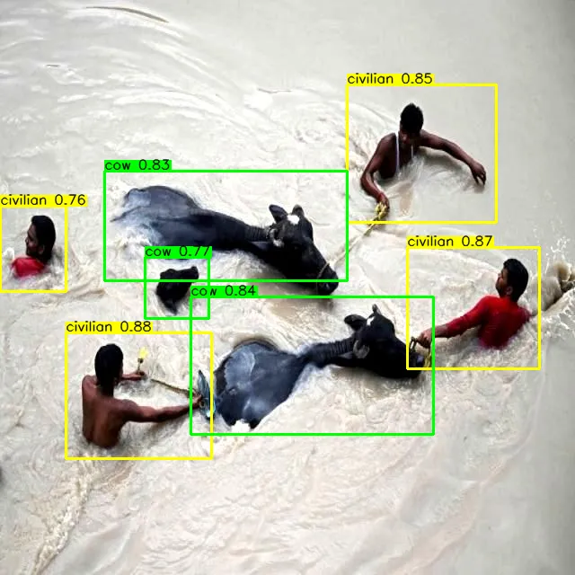
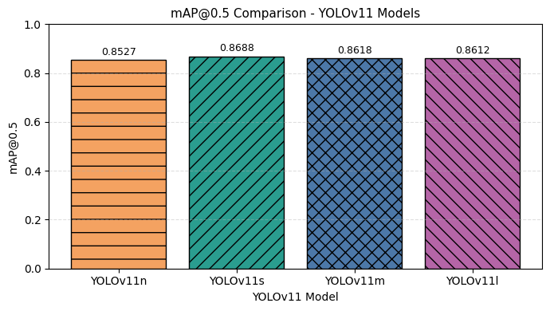

# AeroRescue-AI

**AeroRescue-AI：面向低空应急救援的无人机多模态灾情识别与辅助决策系统**

AeroRescue-AI is a competition-stage prototype for low-altitude UAV emergency rescue. It connects target detection, disaster-scene segmentation, TERP rescue priority modeling, Risk-Aware A* image-plane path planning, and Chinese report generation into one decision-support loop.

The project is designed for a step-by-step competition workflow. It is not a full cloud platform, not a GIS navigation system, and not connected to any large language model API.

## Overview

In flood, collapse, landslide, and post-disaster rescue scenes, UAV imagery can provide fast overhead awareness before rescue teams fully enter the area. AeroRescue-AI turns that visual input into a first-pass decision aid:

1. Upload a UAV-style disaster image or video.
2. Run YOLOv11 target detection.
3. Select a segmentation source: uploaded mask, experimental local checkpoint, or no segmentation fallback.
4. Apply the TERP priority model.
5. Compare baseline A* with Risk-Aware A* image-plane path planning.
6. Generate a Chinese rescue assistance report.

```text
UAV image/video
→ YOLOv11 target detection
→ segmentation source
→ TERP priority model
→ Risk-Aware A* path planning
→ Chinese rescue report
```

## Core Innovation

| Innovation | Description |
| --- | --- |
| Target-Environment-Route Priority Model, TERP | Fuses target class, confidence, bbox scale, environment risk, and route accessibility into a rescue priority score |
| Risk-Aware A* image-plane rescue path planning | Compares uniform-cost baseline A* with segmentation-cost A* to reduce high-risk path exposure |
| Detection-Segmentation-Decision-Report closed loop | Connects UAV image/video input, target detection, segmentation fusion, priority ranking, path planning, and Chinese report generation |
| Reference-inspired UAV rescue platform workflow | Uses public UAV rescue, disaster detection, survivor detection, and segmentation projects as design references while keeping AeroRescue-AI as the main system |

## Reference Repositories

AeroRescue-AI uses public open-source projects as reference material for system design, detection presentation, segmentation classes, and future model comparison workflows. The main prototype remains an AeroRescue-AI detection-segmentation-decision-report system.

| Reference | Use In AeroRescue-AI |
| --- | --- |
| ARGUS | UAV rescue platform workflow, task/report/map-style system expression |
| urban-disaster-monitor | YOLOv11 disaster target detection and Gradio-style demo reference |
| Post-Disaster-Dataset / Detection-Models | Post-disaster survivor detection and model comparison experiment structure |
| RescueNet | Post-disaster UAV semantic segmentation class and mask visualization reference |

Reference and showcase assets can be organized under:

- `static/images/reference/`
- `static/images/showcase/`

These images are used as prototype presentation material for the current competition-stage system.

## Current Capabilities

| Module | Status | Output |
| --- | --- | --- |
| YOLOv11 Disaster Target Detection | Done | Annotated image/video, class, confidence, bbox |
| Target Structuring | Done | `id`, `class_name`, `confidence`, `bbox`, `center`, `area` |
| Risk Scoring | Done | Low / Medium / High risk levels |
| Rescue Priority Ranking | Done | Ranked target table with Chinese rescue reasons |
| TERP Priority Model | Done | Target-environment-route priority score and level |
| Report Generation | Done | Template-based Chinese rescue assistance report |
| Uploaded Segmentation Mask | Done | Class-id/RGB mask parsing, overlay, area summary |
| Mask Validation | Done | Validates class ids, shape, unknown ids, and fallback behavior |
| Environment Risk Fusion | Done | Target risk enhanced by nearby environmental risk |
| A* Path Planning | Done | Image-plane reference route to the highest-risk target |
| Risk-Aware A* Path Planning | Done | Segmentation-cost route planning |
| Baseline vs Risk-Aware A* Comparison | Done | Path length, path cost, high-risk area ratio, risk reduction |
| Path Overlay | Done | Start point, target point, and planned path overlay |
| Auto Segmentation Model | Experimental | Uses a local checkpoint if provided; otherwise falls back safely |
| Demo Gallery | Done | Local project demo visuals and workflow summary in Gradio |
| Demo Cases Plan | Done | 3-5 competition scenario case structure |
| Demo Case Generator | Done | Offline script writes showcase artifacts without starting Gradio |
| Showcase Outputs | Current | Generated case outputs under `static/images/showcase/` |
| Model Comparison Scaffold | Done | Registry, evaluator scaffold, and results template without fake metrics |
| Platform Workflow Document | Done | Future platform workflow design under `docs/platform_workflow.md` |
| Core Smoke Test | Done | Lightweight no-download test for segmentation and path planning |
| Video Tab | Basic Preview | Detection video output and detected class names |

Current segmentation fusion, environment-enhanced risk ranking, report generation, and path planning are supported in the **Image Tab**. The **Video Tab** remains a lightweight detection preview and does not currently produce risk ranking, segmentation summaries, path planning, or rescue reports.

## Detection Classes

| Class | Meaning | Rescue Interpretation |
| --- | --- | --- |
| `civilian` | Civilian / possible trapped person | Highest-priority rescue target |
| `rescuer` | Rescue worker | Used to recognize existing rescue activity |
| `dog` | Dog | Domestic animal rescue target |
| `cat` | Cat | Domestic animal rescue target |
| `horse` | Horse | Large animal rescue target |
| `cow` | Cow | Large animal rescue target |

The detector separates `civilian` and `rescuer` so that people already participating in rescue work are not treated the same as possible trapped civilians.

## Demo Gallery

The project uses local assets stored under `static/images/`, `static/images/reference/`, and `static/images/showcase/` for README and Gradio gallery display.

## Demo Website

A static competition showcase website is available under `docs/`.

To publish it with GitHub Pages:

1. Open the repository Settings on GitHub.
2. Go to Pages.
3. Set source to `Deploy from a branch`.
4. Select branch `main` and folder `/docs`.
5. Save and wait for GitHub Pages to publish.

The static site introduces AeroRescue-AI, shows the workflow, core innovations, generated demo cases, and local run commands. It is a presentation website only; the interactive AI demo still runs through the local Gradio app.

<div align="center">


</div>

The Gradio interface keeps the current prototype lightweight while exposing the full Image Tab workflow.

<div align="center">


</div>

Example local detection preview:

<div align="center">




</div>

Model comparison and evaluation assets:

<div align="center">


</div>

## Demo Cases

AeroRescue-AI includes five competition-oriented case templates:

| Case | Focus |
| --- | --- |
| Flood Civilian Rescue | water risk, TERP priority, Risk-Aware A* |
| Building Collapse | major damage / destroyed building environment risk |
| Road Blocked | road-blocked path cost and detour explanation |
| Multi-target Priority | TERP ranking across different target types |
| No Target / Fallback | safe no-target report and fallback behavior |

Generate local showcase outputs:

```bash
python scripts/generate_demo_cases.py
```

Generated artifacts are saved under `static/images/showcase/<case_id>/`. Demo masks generated by the script are manually prepared for decision-layer demonstration and are not automatic segmentation predictions.

## Model Comparison

The `model_comparison/` directory prepares the future Detection-Models-style experiment stage.

- `model_registry.json` lists YOLOv11 variants and optional future detectors.
- `evaluate_detection_models.py` can check local weights and run a small inference summary on a local image folder.
- `results_template.csv` is a blank template, not a final metrics table.

This repository does not fabricate mAP, precision, recall, FPS, or latency results. Metrics should only be filled after real local evaluation.

## Platform Workflow

`docs/platform_workflow.md` describes a future platform workflow inspired by UAV rescue system design:

```text
Mission Management
→ UAV Image/Video Upload
→ Detection Result Review
→ Segmentation/Environment Layer
→ TERP Priority Dashboard
→ Risk-Aware Route Planner
→ Report Center
→ Case Archive
```

The current repository remains a local Gradio prototype, not a full cloud platform, GIS system, GPS router, database application, or UAV flight-control system.

<div align="center">



</div>

## Segmentation Integration

Level 1 Done:

- Uploaded segmentation mask parsing
- Class-id mask and RGB color mask support
- Segmentation overlay
- Environmental area summary
- Environment-enhanced risk ranking
- A* cost map generation from segmentation classes

Level 2 Experimental:

- Optional automatic segmentation inference if a trained checkpoint is available locally.
- Supported checkpoint locations:
  - `checkpoints/segmentation_model.pth`
  - `app/segmentation_weights/segmentation_model.pth`

Level 3 Planned:

- Full local training and evaluation on disaster-scene segmentation data.
- Report pixel accuracy, mean IoU, and per-class IoU.
- Replace manual mask upload with validated automatic segmentation inference after a real checkpoint is trained.

The repository does **not** include a full segmentation dataset or a large pretrained segmentation checkpoint. If no checkpoint exists, `Auto Segmentation Model` will show a clear status message and fall back to no segmentation mask. It will not generate fake segmentation results.

Class-id masks should use PNG. JPG compression can change pixel values and break class-id semantics.

## Segmentation Classes

| ID | Class | Use In This System |
| ---: | --- | --- |
| 0 | `background` | Default unknown area |
| 1 | `water` | High-risk flood/water area |
| 2 | `no_damage_building` | Low-risk building region |
| 3 | `minor_damage` | Medium-risk damaged building |
| 4 | `major_damage` | High-risk damaged building |
| 5 | `destroyed_building` | High-risk destroyed building |
| 6 | `vehicle` | Medium-risk obstacle/vehicle area |
| 7 | `road_clear` | Low-cost passable road |
| 8 | `road_blocked` | High-cost blocked road |
| 9 | `tree` | Medium-risk occlusion/vegetation area |
| 10 | `pool` | High-risk water/pool area |

## Risk Scoring

Without segmentation mask, the system uses target-only scoring:

```text
risk_score = class_weight * 70 + confidence * 20 + area_weight * 10
```

With segmentation mask, the system uses environment-enhanced scoring:

```text
base_target_score = class_weight * 55 + confidence * 15 + area_weight * 10
final_risk_score = base_target_score + environment_score
```

Risk levels:

| Score Range | Level |
| --- | --- |
| 0-40 | Low |
| 40-70 | Medium |
| 70-100 | High |

## TERP Priority Model

TERP means **Target-Environment-Route Priority Model**.

Chinese name:

**目标—环境—可达性联合救援优先级评估模型**

```text
target_score = class_weight * 45 + confidence * 15 + area_weight * 10
environment_score = 0-20
accessibility_score = 0-20
terp_score = target_score + environment_score + accessibility_score
```

TERP levels:

| Score Range | Level |
| --- | --- |
| 0-40 | Low |
| 40-70 | Medium |
| 70-90 | High |
| 90+ | Critical |

## A* Path Planning

The Image Tab includes baseline A* and Risk-Aware A* image-plane path planning.

- Baseline A* uses a uniform cost map.
- Risk-Aware A* uses segmentation class costs.
- If no segmentation mask is available, the comparison is limited and both routes use default assumptions.
- The route starts from `Rescue Start X / Rescue Start Y`.
- If `start_y = -1`, the app uses the lower-left default start point.
- The goal is the highest-risk ranked target.

This is a reference path on the image plane. It is not a GPS route and does not use real road networks, drone flight control, or live map data.

## Repository Structure

```text
.
├── app
│   ├── app.py
│   ├── risk_engine.py
│   ├── environment_risk.py
│   ├── segmentation_engine.py
│   ├── segmentation_model.py
│   ├── priority_ranker.py
│   ├── report_generator.py
│   ├── path_planner.py
│   ├── terp_engine.py
│   ├── requirements.txt
│   └── examples
├── training
│   ├── train_segmentation.py
│   └── evaluate_segmentation.py
├── scripts
│   └── generate_demo_cases.py
├── model_comparison
│   ├── README.md
│   ├── model_registry.json
│   ├── evaluate_detection_models.py
│   └── results_template.csv
├── docs
│   └── platform_workflow.md
├── tests
│   └── smoke_test_core.py
├── demo_cases
│   └── README.md
├── models
│   ├── yolov11n
│   ├── yolov11s
│   ├── yolov11m
│   └── yolov11l
├── static
│   └── images
│       ├── reference
│       └── showcase
├── FIRST_STEP_RUN.md
├── SECOND_STEP_DECISION_LAYER.md
├── THIRD_STEP_SEGMENTATION_LAYER.md
├── FOURTH_STEP_PATH_PLANNING.md
├── SEGMENTATION_DATASET_SETUP.md
├── SEGMENTATION_INTEGRATION.md
└── TERP_AND_PATH_PLANNING.md
```

Large local data and checkpoints should stay outside Git tracking:

```text
data/
datasets/
checkpoints/
```

## Environment

Recommended:

- Python 3.10 to 3.12
- macOS, Linux, or Windows
- GPU optional

CPU inference works for images. Video processing on CPU can be slow, so the Video Tab provides frame skipping and a full-video/limited-frame option.

## Run Locally

```bash
git clone https://github.com/lheng2386-png/low-altitude-smart-rescue-demo.git
cd low-altitude-smart-rescue-demo/app

python3 -m venv venv
source venv/bin/activate

python -m pip install --upgrade pip
pip install -r requirements.txt

python app.py
```

Open:

```text
http://127.0.0.1:7860
```

## Image Tab Testing

Uploaded Mask mode:

1. Select `Segmentation Source = Uploaded Mask`.
2. Upload an image.
3. Upload `app/examples/masks/demo_rescuenet_mask.png`.
4. Click `Process Image`.
5. Check processed image, segmentation overlay, path overlay, detection details, segmentation summary, risk ranking, path summary, and rescue report.

Auto Segmentation Model mode without checkpoint:

1. Select `Segmentation Source = Auto Segmentation Model`.
2. Upload an image.
3. Do not provide a checkpoint.
4. The app should show a fallback status and continue with target-only/default-cost logic.

None mode:

1. Select `Segmentation Source = None`.
2. Upload an image.
3. The app should skip segmentation and continue with target-only risk scoring and default-cost path planning.

Core smoke test:

```bash
python tests/smoke_test_core.py
```

Expected output:

```text
AeroRescue-AI demo case and model comparison smoke test passed.
```

## Train A Local Segmentation Model

Prepare local data as described in [SEGMENTATION_DATASET_SETUP.md](SEGMENTATION_DATASET_SETUP.md), then run:

```bash
python training/train_segmentation.py \
  --data-root data/segmentation \
  --epochs 20 \
  --batch-size 4 \
  --lr 1e-4 \
  --input-size 512 \
  --model unet \
  --num-classes 11 \
  --output checkpoints/segmentation_model.pth
```

Evaluate:

```bash
python training/evaluate_segmentation.py \
  --data-root data/segmentation \
  --split val \
  --checkpoint checkpoints/segmentation_model.pth \
  --save-overlays
```

## Project Status

Completed in the current prototype:

- Local Gradio app
- Local YOLOv11 detection from `models/<variant>/best.pt`
- Image detection details
- Video detection preview
- Risk scoring and priority ranking
- TERP priority model
- Chinese rescue report generation
- Uploaded segmentation mask fusion
- Optional auto segmentation checkpoint interface
- A* image-plane path planning
- Baseline vs Risk-Aware A* comparison
- Mask validation
- Demo Gallery
- Demo cases plan
- Demo case generator
- Showcase outputs
- Model comparison scaffold
- Platform workflow document
- Core smoke test

## Roadmap

- Step 1 Detection Demo: done
- Step 2 Decision Layer: done
- Step 3 Segmentation Integration: done
- Step 4 Path Planning: done
- Step 5 TERP + Risk-Aware A*: done in current prototype
- Step 6 Demo Cases + Showcase Outputs: current
- Step 7 Model Comparison Experiments: scaffold done / planned
- Step 8 Presentation + Demo Video: next
- Step 9 Platform Architecture: planned
- Step 10 NOTICE / Attribution / License final cleanup: final stage

Planned next:

- Prepare 3-5 complete demo case videos
- Improve Risk-Aware A* passability constraints
- Add multi-target rescue sequence planning
- Add model comparison experiments
- Prepare presentation / demo video

## Image Policy

The README and demo gallery focus on AeroRescue-AI project materials, local outputs, and reference-inspired assets. External reference images may be used during the current development stage, but they should not be presented as AeroRescue-AI generated outputs unless they were actually produced by this repository.
