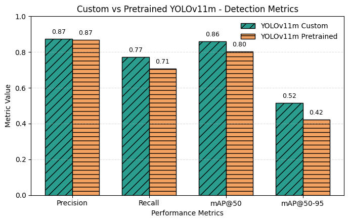

# Low-Altitude Smart Rescue Demo

**低空智援：面向灾害救援的无人机智能感知与辅助决策系统**

This repository is the current competition demo for a low-altitude UAV rescue assistance system. The current version focuses on a Gradio-based YOLO disaster target detection workflow plus an initial decision layer for risk scoring, rescue priority ranking, and template-based Chinese rescue report generation.

The project is intentionally lightweight at this stage. It does not integrate ARGUS, Detection-Models, RescueNet, FastAPI, React, Docker, or any large language model API.

<div align="center">


</div>

## Project Goal

Low-altitude UAVs can rapidly collect images and videos from flooded streets, collapsed buildings, blocked roads, and isolated rural areas. This demo turns UAV-style disaster imagery into structured rescue information:

- detect civilians, rescuers, and animals in disaster scenes;
- show detection boxes, classes, confidence, and coordinates;
- convert detections into unified target records;
- estimate initial rescue risk from class, confidence, and target area;
- rank targets by rescue priority;
- generate a first-pass Chinese rescue report.

This is not a replacement for field command judgment. It is a decision-support prototype designed to make early visual triage faster and more structured.

## Demo Preview

<div align="center">


</div>

The Gradio page supports image and video input. For image detection, the current app returns four outputs: annotated image, detection details table, risk ranking table, and generated rescue report.

Example detection material:

<div align="center">


</div>

## Current Status

Completed:

- Gradio image/video demo can be started locally.
- YOLO weights are loaded from local files under `models/<variant>/best.pt`.
- Image upload returns an annotated detection result image.
- Detection details include class, confidence, bounding box, center point, and area.
- Initial risk scoring is added for detected rescue targets.
- Rescue targets are ranked by priority.
- A Chinese rescue report is generated from detection and ranking results.

Not included yet:

- ARGUS platform integration
- Detection-Models comparison experiments
- RescueNet semantic segmentation
- Route planning
- Large language model API report generation

## Target Classes

| Class | Meaning | Rescue Interpretation |
| --- | --- | --- |
| `civilian` | Civilian / possible rescue target | Highest priority visual target |
| `rescuer` | Rescue worker | Helps distinguish rescue teams from trapped civilians |
| `dog` | Dog | Domestic animal rescue target |
| `cat` | Cat | Domestic animal rescue target |
| `horse` | Horse | Large animal rescue target |
| `cow` | Cow | Large animal rescue target |

Distinguishing `civilian` from `rescuer` is important in emergency imagery. A generic person detector would treat all people as the same class, which can create false rescue alerts in areas already occupied by emergency teams.

## Dataset And Model Notes

The included YOLO-format dataset is organized for six disaster response classes. It contains images and labels for training, validation, and testing:

| Split | Images | Labels |
| --- | ---: | ---: |
| Train | 2,674 | 2,674 |
| Validation | 383 | 383 |
| Test | 183 | 183 |

Class annotation counts from the dataset documentation:

| Class | Annotated Objects | Images Containing Class |
| --- | ---: | ---: |
| `civilian` | 3,150 | 1,060 |
| `rescuer` | 1,074 | 397 |
| `dog` | 531 | 373 |
| `cat` | 637 | 207 |
| `horse` | 811 | 279 |
| `cow` | 749 | 180 |

The current detector uses Ultralytics YOLOv11. Available local model variants:

| Variant | Expected Weight Path | Typical Use |
| --- | --- | --- |
| YOLOv11n | `models/yolov11n/best.pt` | Fastest lightweight demo |
| YOLOv11s | `models/yolov11s/best.pt` | Balanced lightweight option |
| YOLOv11m | `models/yolov11m/best.pt` | Better accuracy, slower than small models |
| YOLOv11l | `models/yolov11l/best.pt` | Larger model, slower CPU inference |

<div align="center">



</div>

## Decision Layer

The second-stage decision layer converts YOLO boxes into rescue target records:

```json
{
  "id": "T001",
  "class_name": "civilian",
  "confidence": 0.86,
  "bbox": [x1, y1, x2, y2],
  "center": [cx, cy],
  "area": 12345.0
}
```

The initial risk formula is:

```text
risk_score = class_weight * 70 + confidence * 20 + area_weight * 10
```

Class weights:

| Class | Weight |
| --- | ---: |
| `civilian` | 1.00 |
| `horse` | 0.65 |
| `cow` | 0.65 |
| `dog` | 0.55 |
| `cat` | 0.55 |
| `rescuer` | 0.15 |

Risk levels:

| Score Range | Level |
| --- | --- |
| 0-40 | Low |
| 40-70 | Medium |
| 70-100 | High |

See [SECOND_STEP_DECISION_LAYER.md](SECOND_STEP_DECISION_LAYER.md) for the full second-stage design.

## Repository Structure

```text
.
├── app
│   ├── app.py
│   ├── risk_engine.py
│   ├── priority_ranker.py
│   ├── report_generator.py
│   ├── requirements.txt
│   └── examples
├── models
│   ├── yolov11n
│   ├── yolov11s
│   ├── yolov11m
│   └── yolov11l
├── dataset
├── notebooks
├── static
├── FIRST_STEP_RUN.md
└── SECOND_STEP_DECISION_LAYER.md
```

## Environment

Recommended:

- Python 3.10 to 3.12
- macOS, Linux, or Windows
- GPU is optional

CPU inference works for image detection. Video detection can run on CPU, but it may be slow.

The current local verification used Python 3.12.

## Run Locally

```bash
git clone https://github.com/lheng2386-png/low-altitude-smart-rescue-demo.git
cd low-altitude-smart-rescue-demo/app

python3 -m venv venv
source venv/bin/activate

python -m pip install --upgrade pip
pip install -r requirements.txt

python app.py
```

Open the local Gradio address:

```text
http://127.0.0.1:7860
```

If port `7860` is already occupied, stop the old process or change the Gradio port in `app/app.py`.

## App Outputs

After uploading an image, the page returns:

- Annotated image with detection boxes
- Detection details table
- Risk ranking table
- Generated Chinese rescue report

If no target is detected, the app keeps the tables empty and reports:

```text
当前图像未检测到明确救援目标
```

## Deployment Note

The previous Hugging Face Space deployment workflow has been removed because it pointed to an old external Space and required a missing or unrelated secret. This repository is currently maintained as a local Gradio demo.

Before enabling automatic deployment again, configure a new deployment target, repository secret, and workflow owned by this project.

## Next Step

The next planned stage is to connect RescueNet semantic segmentation so the system can include environmental risk factors such as flood water, blocked roads, damaged buildings, vehicles, and passable areas.

## License And Attribution

This repository contains adapted open-source code, dataset structure, model artifacts, and documentation assets. Keep the license and citation files with the repository when redistributing or publishing the project.
