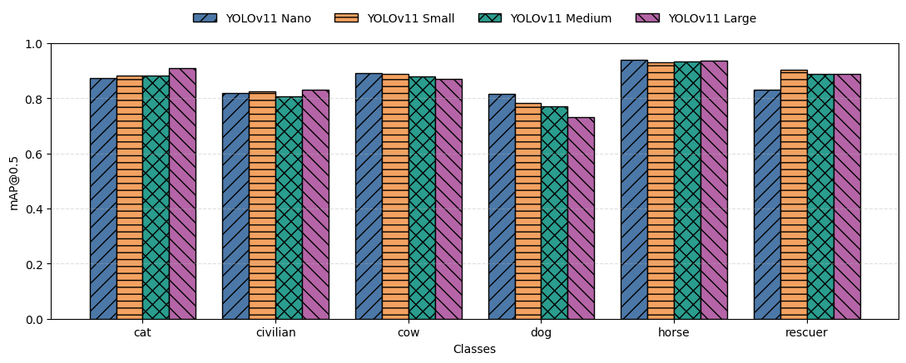
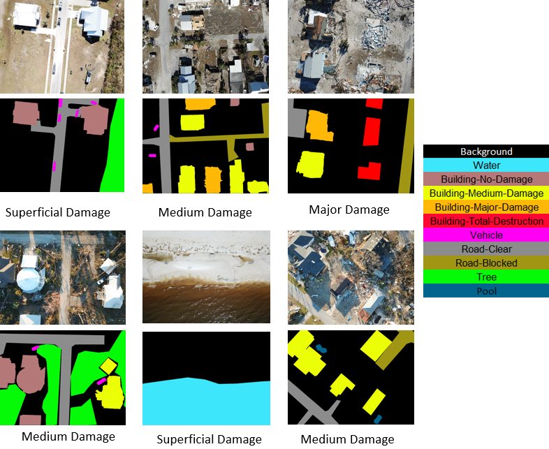
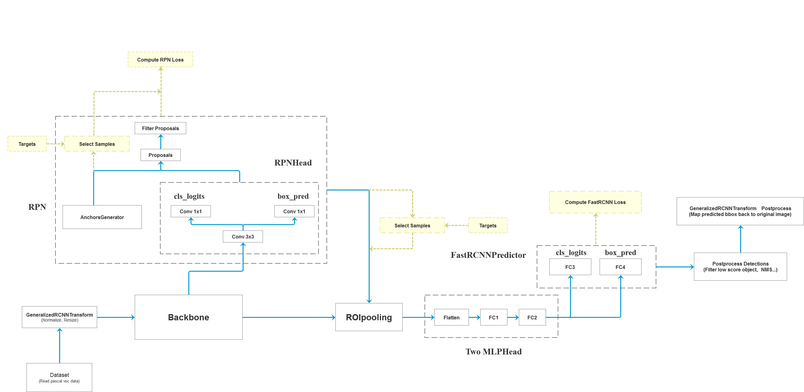
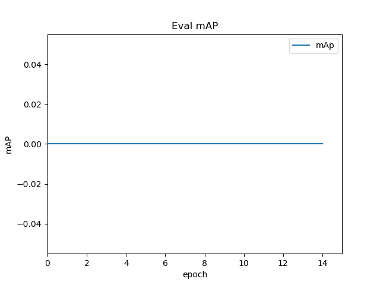
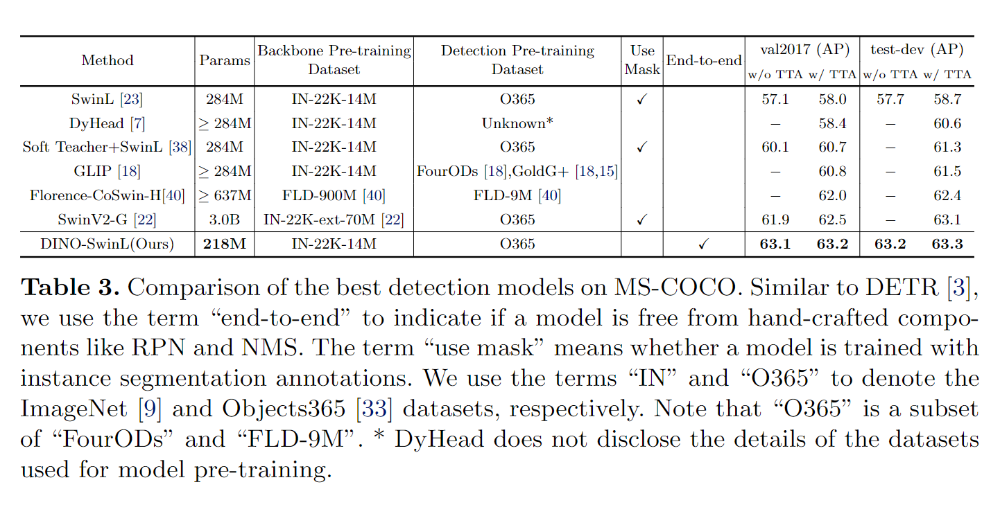
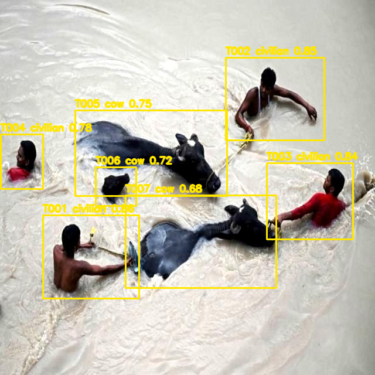
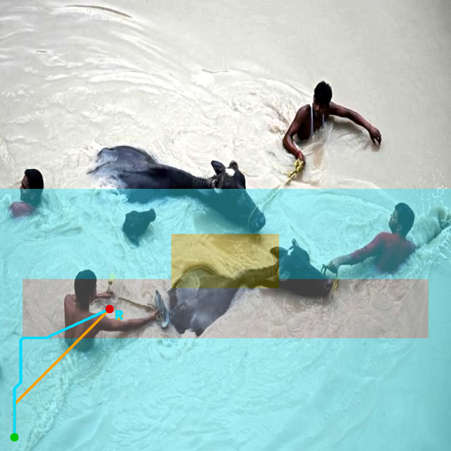

# AeroRescue-AI

**AeroRescue-AI：面向低空应急救援的无人机多模态灾情识别与辅助决策系统**

AeroRescue-AI is a competition-stage low-altitude UAV emergency rescue AI system. It fuses mature open-source platform workflow ideas, YOLOv11 disaster target detection, post-disaster model-comparison structures, RescueNet-style semantic segmentation, TERP rescue priority modeling, risk-aware image-plane access planning, and Chinese rescue report generation into one unified decision-support prototype.

<div align="center">


</div>

```text
UAV Image / Video
→ Disaster Target Detection
→ Disaster-Scene Segmentation
→ TERP Priority Decision
→ Scene Applicability Gate
→ Risk-Aware Access Planning
→ Rescue Report
→ Platform-style Case Archive
```

## What Is AeroRescue-AI

AeroRescue-AI is not just a loose Gradio demo. It is a competition-stage prototype for low-altitude UAV emergency rescue. The current local application demonstrates the complete closed loop:

1. Upload UAV-style disaster imagery.
2. Detect civilians, rescuers, and animals.
3. Add disaster-scene segmentation through uploaded masks, experimental checkpoints, or fallback mode.
4. Evaluate rescue priority with TERP.
5. Compare ordinary A* and risk-aware A* image-plane access planning.
6. Generate a Chinese rescue assistance report.
7. Archive generated case outputs for presentation and review.

The current system is still local and prototype-oriented. It is not a deployed cloud platform, not real GPS navigation, and not connected to UAV flight control.

## Full Deep Fusion

AeroRescue-AI now integrates mature reference material as concrete project files instead of leaving the four repositories as light citations.

| Fusion Source | Integrated Role | Concrete Project Integration |
| --- | --- | --- |
| ARGUS | Platform-style UAV rescue workflow | `integrated_modules/argus/`, `platform/`, `docs/platform_design_from_argus.md`, platform reference assets |
| urban-disaster-monitor | YOLOv11 disaster target detection | `integrated_modules/urban_disaster_monitor/`, copied Gradio app, copied sample images, detection gallery assets |
| Post-Disaster-Dataset / Detection-Models | Survivor detection and model comparison | `integrated_modules/detection_models/`, `model_comparison/`, copied DINO/Faster R-CNN structures, reference figures |
| RescueNet-style segmentation | Disaster-scene semantic segmentation | `integrated_modules/rescuenet/`, `segmentation_reference/`, copied segmentation class figure and model structures |

See:

- `FULL_DEEP_FUSION.md`
- `MODULE_FUSION_SUMMARY.md`
- `REFERENCE_RESULTS.md`

## Core Mature Modules

| Module | Status | Output |
| --- | --- | --- |
| Detection Module | Implemented | Annotated image/video, class, confidence, bounding box |
| Segmentation Module | Implemented + experimental auto checkpoint | Overlay, area summary, environment context |
| Decision Module | Implemented | Risk score, TERP score, rescue priority ranking |
| Scene Applicability Gate | Implemented as fallback policy | Blocks over-claiming when targets, masks, or checkpoints are missing |
| Risk-Aware Access Planning | Implemented | Ordinary A* vs risk-aware A* comparison and path overlay |
| Report Module | Implemented | Chinese rescue assistance report |
| Platform Mockup Module | Integrated | Mission dashboard, report center, case archive design |
| Model Comparison Module | Integrated | Reference benchmark assets and reproducible evaluation scaffold |

## Detection Gallery

The detection module uses the six disaster-response classes `civilian`, `rescuer`, `dog`, `cat`, `horse`, and `cow`. The active AeroRescue-AI app keeps local YOLOv11 weights under `models/<variant>/best.pt` and does not download models at runtime.

<div align="center">


</div>

<div align="center">




</div>

Reference figures above are used as detection-module presentation assets. AeroRescue-AI generated outputs are stored separately under `static/images/showcase/`.

## Segmentation Gallery

The segmentation module follows an 11-class disaster-scene mask system:

`background`, `water`, `no_damage_building`, `minor_damage`, `major_damage`, `destroyed_building`, `vehicle`, `road_clear`, `road_blocked`, `tree`, `pool`.

<div align="center">



</div>

Supported modes:

- Uploaded class-id or RGB mask.
- Manually prepared demo mask for decision-layer demonstration.
- Optional automatic segmentation checkpoint if a trained local checkpoint exists.
- No-segmentation fallback.

Manual demo masks are not automatic segmentation predictions. Auto segmentation remains experimental until a real checkpoint and evaluation results are provided.

## Model Comparison Gallery

The model comparison module now contains copied reference structures and reference figures. It does not fabricate mAP, FPS, or latency.

<div align="center">




</div>

<div align="center">




</div>

See `model_comparison/reference_results.md` and `model_comparison/results_template.csv`.

## Platform Workflow Gallery

The project now contains a platform-style rescue workflow package under `platform/` and copied platform structures under `integrated_modules/argus/`.

```text
Mission Dashboard
→ UAV Image / Video Upload
→ Detection Review
→ Segmentation Environment Layer
→ TERP Dashboard
→ Scene Applicability Gate
→ Risk-Aware Access Planner
→ Report Center
→ Case Archive
```

The current product is a platform-inspired prototype. It does not claim to run a full cloud platform.

## AeroRescue-AI Innovations

| Innovation | Description |
| --- | --- |
| TERP | Target-Environment-Route Priority Model combines target type, confidence, scale, environment risk, and route accessibility |
| Scene Applicability Gate | Prevents unsupported decisions when targets, masks, or checkpoints are missing |
| Risk-Aware Access Planning | Compares ordinary A* and segmentation-cost A* on the image plane |
| Detection-Segmentation-Decision-Report Closed Loop | Turns UAV imagery into detection, environment understanding, priority ranking, path suggestion, and Chinese report |
| Multi-source Repository Fusion | Integrates mature platform, detection, benchmark, and segmentation assets into one rescue prototype |

## Demo Cases

Generated outputs are available under `static/images/showcase/`.

| Case | Focus |
| --- | --- |
| Case 01 Flood Civilian Rescue | Water risk, TERP priority, risk-aware route |
| Case 02 Building Collapse | Major / destroyed building risk |
| Case 03 Road Blocked | Road-block cost and route detour |
| Case 04 Multi-target Priority | Multiple target ranking |
| Case 05 No Target / Fallback | Safe fallback behavior |

<div align="center">




</div>

Demo masks generated by the case script are manually prepared for decision-layer demonstration. They are not automatic segmentation predictions.

## Run Locally

```bash
cd app
python app.py
```

Open:

```text
http://127.0.0.1:7860/
```

Run smoke tests:

```bash
python tests/smoke_test_core.py
```

Generate demo cases:

```bash
python scripts/generate_demo_cases.py
```

Run model comparison help:

```bash
python model_comparison/evaluate_detection_models.py --help
```

## Repository Structure

```text
app/                         Gradio app and decision modules
integrated_modules/          Copied / migrated reference code and README material
static/images/reference/     Reference assets separated by source
static/images/showcase/      AeroRescue-AI generated outputs
platform/                    Platform-inspired dashboard and workflow mockups
model_comparison/            Detection benchmark and reference-result module
segmentation_reference/      Segmentation classes, palette, and sample assets
demo_cases/                  Case configs and expected outputs
docs/                        Static site and design documents
```

## Current Limitations

- Current system is a competition-stage local prototype, not a complete cloud platform.
- Path planning is image-plane reference planning, not real GPS navigation.
- No real road network, GIS engine, UAV localization, or flight-control system is connected.
- Automatic segmentation requires a trained local checkpoint; without one, the system falls back to uploaded masks or no segmentation.
- Reference benchmark figures are not AeroRescue-AI reproduced results.
- Manual demo masks are not automatic segmentation predictions.

## Roadmap

| Step | Status |
| --- | --- |
| Step 1 Detection Demo | Done |
| Step 2 Decision Layer | Done |
| Step 3 Segmentation Integration | Done |
| Step 4 Path Planning | Done |
| Step 5 TERP + Risk-Aware A* | Done |
| Step 6 Demo Cases + Showcase Outputs | Done |
| Step 7 Full Deep Fusion | Current |
| Step 8 Formal Model Comparison | Planned |
| Step 9 Platform UI / Dashboard Prototype | Planned |
| Step 10 Presentation Video + PPT | Planned |
| Step 11 NOTICE / Attribution / License cleanup | Final stage |

## Final Compliance TODO

NOTICE / Attribution / License cleanup will be completed before final public release or competition submission.
