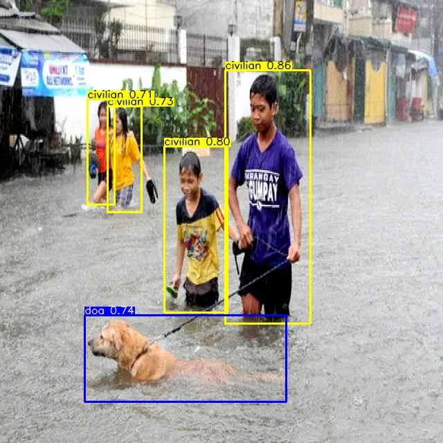
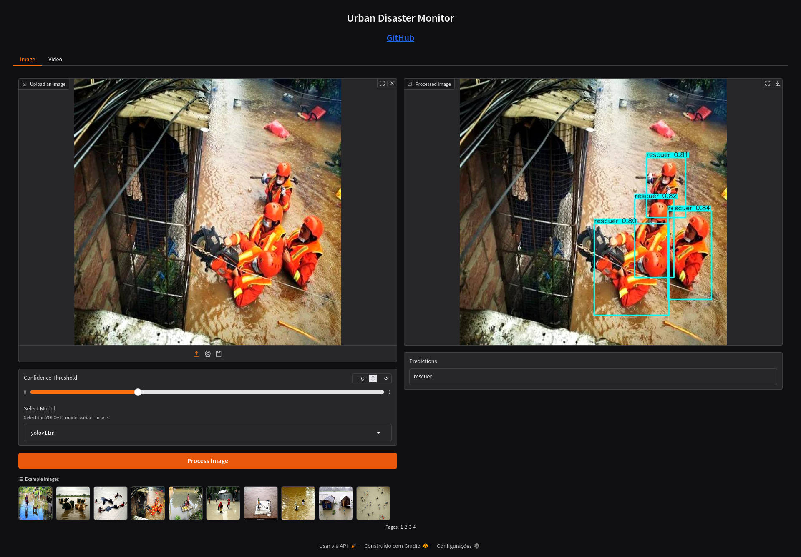
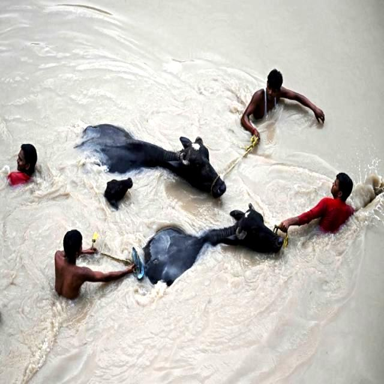
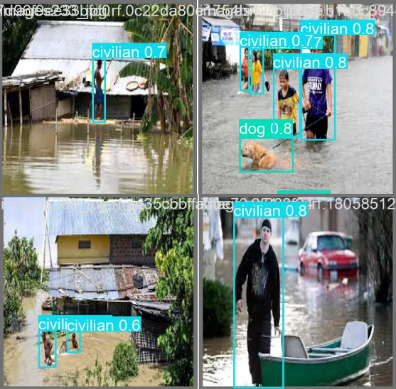
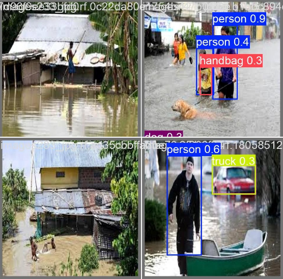

# AeroRescue-AI

**AeroRescue-AI：面向低空应急救援的无人机多模态灾情识别与辅助决策系统**

This repository is a competition-stage prototype for low-altitude UAV disaster rescue assistance. It starts from UAV-style images or videos, detects rescue-related targets with YOLOv11, optionally reads RescueNet-style semantic segmentation masks, converts detections into structured target records, estimates risk, ranks rescue priority, and generates a first-pass Chinese rescue report.

At the current stage, the project is deliberately kept as a lightweight Gradio demo. It does not integrate ARGUS, Detection-Models, FastAPI, React, Docker, route planning, or any large language model API yet. RescueNet is currently used as a semantic mask format and environmental-risk reference, not as an automatic segmentation model.

Current segmentation mask fusion, environment-enhanced risk ranking, risk scoring, rescue priority ranking, and report generation are available in the Image Tab only. The Video Tab is currently a basic detection preview and does not yet produce segmentation summaries, risk ranking, or rescue reports.

<div align="center">



</div>

## Overview

In flood, landslide, collapse, and post-disaster urban-rural rescue scenes, UAVs can quickly provide overhead visual information before rescuers fully enter the area. The challenge is turning these images into actionable rescue information: who or what was detected, where the target is, how confident the model is, and which target should be handled first.

This demo focuses on the first usable loop:

1. Upload a disaster image or video in a Gradio interface.
2. Run local YOLOv11 disaster target detection.
3. Display bounding boxes, classes, confidence, and coordinates.
4. Standardize each detection into a rescue target record.
5. Optionally upload a RescueNet-style segmentation mask.
6. Summarize environmental risk areas such as water, blocked roads, and damaged buildings.
7. Fuse target risk and environment risk.
8. Rank targets by rescue priority.
9. Generate a template-based Chinese rescue report.

## Current Capabilities

| Module | Current Implementation | Output |
| --- | --- | --- |
| Target detection | Ultralytics YOLOv11 local weights | Annotated image/video, class, confidence, bbox |
| Target structuring | Detection result parser in `app/app.py` | `id`, `class_name`, `confidence`, `bbox`, `center`, `area` |
| Segmentation mask parsing | `app/segmentation_engine.py` | RescueNet-style mask, overlay, class area summary |
| Environment risk | `app/environment_risk.py` | Water, blocked road, damaged building risk scores |
| Risk scoring | `app/risk_engine.py` | Target score with optional environment enhancement |
| Priority ranking | `app/priority_ranker.py` | Ranked rescue target table with environment context |
| Report generation | `app/report_generator.py` | Chinese rescue report with optional segmentation summary |
| Interface | Gradio | Upload, model selection, result visualization |

Supported classes:

| Class | Meaning | Rescue Interpretation |
| --- | --- | --- |
| `civilian` | Civilian / possible trapped person | Highest priority visual target |
| `rescuer` | Rescue worker | Helps reduce false alerts in areas already occupied by rescue teams |
| `dog` | Dog | Domestic animal rescue target |
| `cat` | Cat | Domestic animal rescue target |
| `horse` | Horse | Large animal rescue target |
| `cow` | Cow | Large animal rescue target |

Distinguishing `civilian` from `rescuer` is important. Generic person detectors usually merge both into a single `person` class, which can produce misleading rescue alerts when the scene already contains emergency teams.

## Demo Preview

The Gradio page supports image and video input. For image detection, the current interface returns an annotated image, optional segmentation overlay, detection details table, segmentation summary table, risk ranking table, and generated Chinese rescue report. The Video Tab currently returns a processed video preview and detected class names only.

<div align="center">



</div>

Example detection material:

<div align="center">




</div>

## Dataset And Detection Model

The current detector is based on a YOLO-format disaster response dataset with six rescue-related classes. The dataset is organized into training, validation, and test splits:

| Split | Images | Labels |
| --- | ---: | ---: |
| Train | 2,674 | 2,674 |
| Validation | 383 | 383 |
| Test | 183 | 183 |

Class annotation counts:

| Class | Annotated Objects | Images Containing Class |
| --- | ---: | ---: |
| `civilian` | 3,150 | 1,060 |
| `rescuer` | 1,074 | 397 |
| `dog` | 531 | 373 |
| `cat` | 637 | 207 |
| `horse` | 811 | 279 |
| `cow` | 749 | 180 |

The model uses Ultralytics YOLOv11. YOLO is suitable for this first-stage demo because it provides fast single-stage object detection and directly outputs bounding boxes, class labels, and confidence scores.

Available local model variants:

| Variant | Expected Weight Path | Typical Use |
| --- | --- | --- |
| YOLOv11n | `models/yolov11n/best.pt` | Fastest lightweight demo |
| YOLOv11s | `models/yolov11s/best.pt` | Balanced lightweight option |
| YOLOv11m | `models/yolov11m/best.pt` | Higher capacity, slower than small models |
| YOLOv11l | `models/yolov11l/best.pt` | Larger model, slower CPU inference |

<div align="center">


</div>

The trained variants show close mAP@0.5 performance, which makes the smaller models useful for a fast demo or hardware-constrained rescue scenarios. Additional model comparison notebooks are kept under `notebooks/`.

## Why This Dataset Matters

Large general-purpose datasets such as COCO do not separate `civilian` and `rescuer`; both are usually treated as `person`. In emergency imagery, that distinction matters. A scene with only rescue workers should not be treated the same as a scene with trapped civilians.

The dataset also includes domestic and large animals, which are common in flood and rural-peripheral disaster scenes. This supports a broader rescue-assessment workflow than a person-only detector.

<div align="center">




</div>

## Segmentation And Decision Layer

The decision layer turns raw detection boxes into rescue-oriented target records:

```json
{
  "id": "T001",
  "class_name": "civilian",
  "confidence": 0.86,
  "bbox": [x1, y1, x2, y2],
  "center": [cx, cy],
  "area": 12345.0
}
```

Without segmentation mask, the system uses the second-stage target-only formula:

```text
risk_score = class_weight * 70 + confidence * 20 + area_weight * 10
```

Class weights:

| Class | Weight |
| --- | ---: |
| `civilian` | 1.00 |
| `horse` | 0.65 |
| `cow` | 0.65 |
| `dog` | 0.55 |
| `cat` | 0.55 |
| `rescuer` | 0.15 |

Risk levels:

| Score Range | Level |
| --- | --- |
| 0-40 | Low |
| 40-70 | Medium |
| 70-100 | High |

With a RescueNet-style segmentation mask, the system uses environment-enhanced scoring:

```text
base_target_score = class_weight * 55 + confidence * 15 + area_weight * 10
final_risk_score = base_target_score + environment_score
```

The environment score ranges from 0 to 30. High-risk classes include `water`, `road_blocked`, `major_damage`, and `destroyed_building`. Medium-risk classes include `minor_damage`, `tree`, and `vehicle`. Low-risk classes include `road_clear`, `no_damage_building`, and `background`.

Current third-step segmentation support is mask-based. It is not automatic semantic segmentation model inference. The repository does not include a pretrained RescueNet segmentation checkpoint, so the app does not pretend to automatically segment a raw image. Users can upload a RescueNet-style class-id or RGB mask to activate segmentation mask fusion and environmental risk fusion.

For class-id masks, PNG is recommended. JPG compression can change pixel values and break class-id semantics.

See [SECOND_STEP_DECISION_LAYER.md](SECOND_STEP_DECISION_LAYER.md) for details.
See [THIRD_STEP_SEGMENTATION_LAYER.md](THIRD_STEP_SEGMENTATION_LAYER.md) for the segmentation layer.

## Current Stage

Completed:

- Local Gradio demo can be started.
- YOLO weights are loaded from `models/<variant>/best.pt`.
- Image upload returns an annotated detection result.
- Detection details include class, confidence, bounding box, center point, and area.
- Risk scoring and rescue priority ranking are available.
- A Chinese rescue report is generated without calling any external API.
- Optional RescueNet-style segmentation mask upload is available.
- Segmentation overlay, area summary, and environment-enhanced risk ranking are available when a mask is uploaded.

Not included yet:

- ARGUS-style platform integration
- Detection-Models comparison experiments
- Automatic RescueNet segmentation inference from raw images
- Path planning
- Full web application architecture
- Automatic cloud deployment

## Repository Structure

```text
.
├── app
│   ├── app.py
│   ├── risk_engine.py
│   ├── environment_risk.py
│   ├── segmentation_engine.py
│   ├── priority_ranker.py
│   ├── report_generator.py
│   ├── requirements.txt
│   └── examples
├── models
│   ├── yolov11n
│   ├── yolov11s
│   ├── yolov11m
│   └── yolov11l
├── dataset
├── notebooks
├── static
├── FIRST_STEP_RUN.md
├── SECOND_STEP_DECISION_LAYER.md
└── THIRD_STEP_SEGMENTATION_LAYER.md
```

## Environment

Recommended:

- Python 3.10 to 3.12
- macOS, Linux, or Windows
- GPU is optional

CPU inference works for image detection. Video detection can run on CPU, but it may be slow. The current local verification used Python 3.12.

## Run Locally

```bash
git clone https://github.com/lheng2386-png/low-altitude-smart-rescue-demo.git
cd low-altitude-smart-rescue-demo/app

python3 -m venv venv
source venv/bin/activate

python -m pip install --upgrade pip
pip install -r requirements.txt

python app.py
```

Open the local Gradio address:

```text
http://127.0.0.1:7860
```

If port `7860` is already occupied, stop the old process or change the Gradio port in `app/app.py`.

## Expected App Outputs

After uploading an image, the page returns:

- Annotated image with detection boxes
- Optional segmentation overlay
- Detection details table
- Segmentation summary table, if a mask is uploaded
- Risk ranking table
- Generated Chinese rescue report

The Video Tab currently supports basic YOLO detection preview only. It does not yet support risk scoring, priority ranking, segmentation summary, or report generation.

If no target is detected, the app keeps the tables empty and reports:

```text
当前图像未检测到明确救援目标
```

## Roadmap

1. Stabilize the current Gradio + YOLO detection and decision-layer demo.
2. Keep improving RescueNet-style segmentation mask fusion and prepare segmentation model training.
3. Add A* route planning based on target priority and passable areas.
4. Fuse target detection, segmentation, and path cost into a stronger rescue decision layer.
5. Upgrade from demo interface to a fuller web system inspired by ARGUS-style task management and report workflows.

## Deployment Note

The previous Hugging Face Space deployment workflow has been removed because it pointed to an old external Space and required a missing or unrelated secret. This repository is currently maintained as a local Gradio demo.

Before enabling automatic deployment again, configure a new deployment target, repository secret, and workflow owned by this project.

## License And Attribution

This repository contains adapted open-source code, dataset structure, model artifacts, and documentation assets. Keep the license and citation files with the repository when redistributing or publishing the project.
